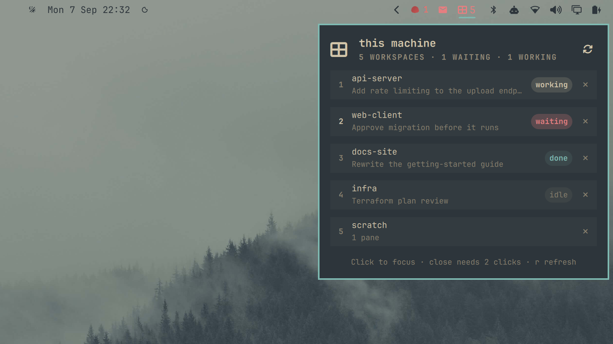

# Herdr

Omarchy bar widget for monitoring [Herdr](https://github.com/herdrdev/herdr) workspaces — on this
machine or on a server over SSH.



## What it does

- Lists Herdr workspaces with the agent state **Herdr itself reports** — waiting, working, done or idle
- Turns the bar icon urgent only when an agent is actually blocked on you
- Click a workspace to focus it on the server; two clicks close it
- Opens a Herdr client in a terminal from the panel header
- Optionally hides idle workspaces, for when you run a lot of them

Because Herdr classifies its own agents, there are no pane-scraping heuristics here. A widget for a
terminal multiplexer has to guess what an agent is doing from the text on screen, and that guess
breaks every time the agent's UI changes. This asks Herdr instead:

```
herdr workspace list     # workspaces, pane/tab counts, rollup status
herdr agent list         # which agent is in which workspace, and its live state
```

`agent_status` is one of `idle`, `working`, `blocked`, `done`, `unknown`. `blocked` — an agent
sitting on a permission prompt or a question — is the one that lights up the bar.

## Requirements

- Omarchy / Quickshell plugin support
- Herdr **0.9.0 or newer** on the machine being polled
- For a remote target: local `ssh` access, and an SSH host or alias in `~/.ssh/config`

## Configuration

| Setting | Default | Meaning |
| --- | --- | --- |
| `host` | `""` | Empty polls the Herdr server on this machine. Otherwise an SSH host or alias. |
| `refreshIntervalSec` | `20` | Poll interval, 10–300s. |
| `hideIdle` | `false` | List only workspaces that are waiting, working or done. |
| `herdrPath` | `""` | Explicit path to the `herdr` binary. Empty auto-detects. |

Add the widget twice — once with an empty `host` and once with a server — to watch both from the bar.

### About `herdrPath`

Bar widgets run from a **non-interactive** shell. Most `~/.bashrc` files begin with a guard like

```bash
[[ $- != *i* ]] && return
```

so any `PATH` you export there does not apply. On a machine with both a distro package in
`/usr/bin` and a newer user install in `~/.local/bin`, a bare `herdr` silently resolves to the
older one, and every call then fails with `protocol_mismatch` against a newer server.

Empty (the default) auto-detects: `~/.local/bin/herdr` when it exists, otherwise `herdr` from
`PATH`. Set an explicit path if your install lives somewhere else.

## Keys

While the panel is open:

- `r` — refresh now
- `o` — open a Herdr client in a terminal
- arrows — scroll
- `Esc` — close

## Privacy

No credentials are stored. The plugin shells out to `herdr` locally, or to `ssh` for a remote host,
and reads only workspace and agent metadata — labels, counts and status. It does not read pane
contents.

## Install

```bash
omarchy plugin add https://github.com/andreconde21/omarchy-herdr.git --enable
```

Or copy the directory into `~/.config/omarchy/plugins/andreconde.herdr/` and run:

```bash
omarchy-shell shell rescanPlugins
omarchy plugin enable andreconde.herdr
```

## Related

[Remote tmux](https://github.com/andreconde21/omarchy-remote-tmux) is the tmux equivalent, kept for
people still on tmux.

## License

MIT
